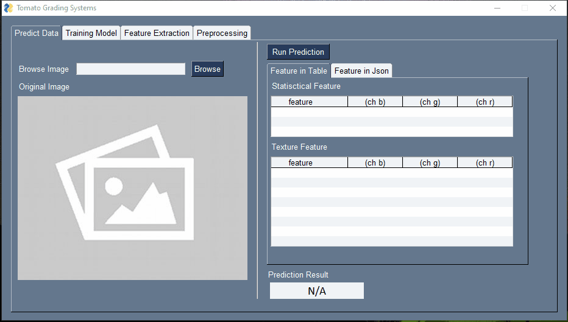
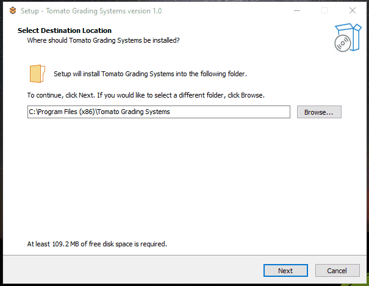

# Aplikasi Klasifikasi Tomat
Resource Belajar membuat aplikasi Klasifikasi Tomat.
## Final App (Tomato Grading Systems)
  
## Installer Wizard by Inno Setup
  
## Learning Material
- Pertemuan 1 (Pengenalan Pemrograan Python & Anaconda) :
    - [download materi (zip)](https://github.com/Muhammad-Yunus/Materi-Training/raw/main/H.%20Klasifikasi%20Tomat%20-%20OpenCV/01.%20Pengenalan%20Python%20%26%20Anaconda/01.%20Pengenalan%20Python%20%26%20Anaconda.zip)
- Pertemuan 2 (Basic Python - Operator) :
    - [download materi (zip)](https://github.com/Muhammad-Yunus/Materi-Training/raw/main/H.%20Klasifikasi%20Tomat%20-%20OpenCV/02.%20Basic%20Python%20-%20Operator/Basic%20Python%20-%20Operator.zip)
- Pertemuan 3 (Basic Python - Flow Control) :
    - [download materi (zip)](https://github.com/Muhammad-Yunus/Materi-Training/raw/main/H.%20Klasifikasi%20Tomat%20-%20OpenCV/03.%20Basic%20Python%20-%20Flow%20Control/Basic%20Python%20-%20Flow%20Control.zip)
- Pertemuan 4 (Basic Python - Data Structures) :
    - [download materi (zip)](https://github.com/Muhammad-Yunus/Materi-Training/raw/main/H.%20Klasifikasi%20Tomat%20-%20OpenCV/04.%20Basic%20Python%20-%20Data%20Structures/Basic%20Python%20-%20Data%20Structures.zip)
- Pertemuan 5 (Basic Python - OOP) :
    - [download materi (zip)](https://github.com/Muhammad-Yunus/Materi-Training/raw/main/H.%20Klasifikasi%20Tomat%20-%20OpenCV/05.%20Basic%20Python%20-%20OOP/Basic%20Python%20-%20OOP.zip)
- Pertemuan 6 (Numpy Matrix Fundamental) :
    - [download materi (zip)](https://github.com/Muhammad-Yunus/Materi-Training/raw/main/H.%20Klasifikasi%20Tomat%20-%20OpenCV/06.%20Numpy%20Matrix%20Fundamental/06.%20Numpy%20Matrix%20Fundamental.zip)
- Pertemuan 7 (OpenCV - Read, Display, Write) :
    - [download materi (zip)](https://github.com/Muhammad-Yunus/Materi-Training/raw/main/H.%20Klasifikasi%20Tomat%20-%20OpenCV/07.%20OpenCV%20-%20Read%2C%20Display%2C%20Write/07.%20OpenCV%20-%20Read%2C%20Display%2C%20Write.zip)
- Pertemuan 8 (OpenCV - Crop, Resize, Convert) :
    - [download materi (zip)](https://github.com/Muhammad-Yunus/Materi-Training/raw/main/H.%20Klasifikasi%20Tomat%20-%20OpenCV/08.%20OpenCV%20-%20Crop%2C%20Resize%2C%20Convert/08.%20OpenCV%20-%20Crop%2C%20Resize%2C%20Convert%20%26%20Tresholding.zip)
- Pertemuan 9 (OpenCV - Tresholding, Masking & Color Segmentation) :
    - [download materi (zip)](https://github.com/Muhammad-Yunus/Materi-Training/raw/main/H.%20Klasifikasi%20Tomat%20-%20OpenCV/09.%20OpenCV%20-%20Tresholding%2C%20Masking%20%26%20Color%20Segmentation/09.%20OpenCV%20-%20Tresholding%2C%20Masking%20%26%20Color%20Segmentation.zip)
- Pertemuan 10 (OpenCV - Edge, Contour & Drawing) :
    - [download materi (zip)](https://github.com/Muhammad-Yunus/Materi-Training/raw/main/H.%20Klasifikasi%20Tomat%20-%20OpenCV/10.%20OpenCV%20-%20Edge%2C%20Contour%20%26%20Drawing/10.%20OpenCV%20-%20Edge%2C%20Contour%20%26%20Drawing.zip) 
- Pertemuan 11 (Feature Extraction - Statistical & Texture) :
    - [download materi (zip)](https://github.com/Muhammad-Yunus/Materi-Training/raw/main/H.%20Klasifikasi%20Tomat%20-%20OpenCV/11.%20Feature%20Extraction%20-%20Statistical%20%26%20Texture/11.%20Feature%20Extraction%20-%20Statistical%20%26%20Texture.zip) 
- Pertemuan 12 (Machine Learning - Basic Implementation) :
    - [download materi (zip)](https://github.com/Muhammad-Yunus/Materi-Training/raw/main/H.%20Klasifikasi%20Tomat%20-%20OpenCV/12.%20Machine%20Learning%20-%20Basic%20Implementation/12.%20Machine%20Learning%20-%20Basic%20Implementation.zip) 
- Pertemuan 13 (Machine Learning - Klasifikasi Tomat) :
    - [download materi (zip)](https://github.com/Muhammad-Yunus/Materi-Training/raw/main/H.%20Klasifikasi%20Tomat%20-%20OpenCV/13.%20Machine%20Learning%20-%20Klasifikasi%20Tomat/13.%20Machine%20Learning%20-%20Klasifikasi%20Tomat.zip)
- Pertemuan 14 (GUI Programming - Layout, Widget & Event) :
    - [download materi (zip)](https://github.com/Muhammad-Yunus/Materi-Training/raw/main/H.%20Klasifikasi%20Tomat%20-%20OpenCV/14.%20GUI%20Programming%20-%20Layout%2C%20Widget%20%26%20Event/14.%20GUI%20Programming%20-%20Layout%2C%20Widget%20%26%20Event.zip)
- Pertemuan 15 (GUI Programming - Layouting Preprocessing & Feature Extraction) :
    - [download materi (zip)](https://github.com/Muhammad-Yunus/Materi-Training/raw/main/H.%20Klasifikasi%20Tomat%20-%20OpenCV/15.%20GUI%20Programming%20-%20Layouting%20Preprocessing%20%26%20Feature%20Extraction/15.%20GUI%20Programming%20-%20Layouting%20Preprocessing%20%26%20Feature%20Extraction.zip)
- Pertemuan 16 (GUI Programming - Layouting Training & Detection) :
    - [download materi (zip)](https://github.com/Muhammad-Yunus/Materi-Training/raw/main/H.%20Klasifikasi%20Tomat%20-%20OpenCV/16.%20GUI%20Programming%20-%20Layouting%20Training%20%26%20Detection/16.%20GUI%20Programming%20-%20Layouting%20Training%20%26%20Detection.zip)
- Pertemuan 17 (GUI Programming - Build App) :
    - [download materi (zip)](https://github.com/Muhammad-Yunus/Materi-Training/raw/main/H.%20Klasifikasi%20Tomat%20-%20OpenCV/17.%20GUI%20Programming%20-%20Build%20App/17.%20GUI%20Programming%20-%20Build%20App.zip) : Materi utama
    - [download Python Installer (exe)](https://www.python.org/ftp/python/3.6.0/python-3.6.0-amd64.exe) : Python Installer 
    - [download final App (zip)](https://github.com/Muhammad-Yunus/Materi-Training/raw/main/H.%20Klasifikasi%20Tomat%20-%20OpenCV/app/app.zip) : Final App untuk di build
    - [download Inno Setup Tool (exe)](https://jrsoftware.org/download.php/is.exe) : Software untuk Create Installation Wizard
- Update 18 (New Dataset Process) :
	- [download materi (zip)]()